# LogFixer — AI Agent 기반 장애 자동 해결 시스템

> **장애 탐지부터 원인 분석, 서버 조치, 결과 보고까지 전 과정을 자동화한 AI Agent 백엔드 시스템**  
> Python · FastAPI · OpenAI API · RAG · SSH · Slack · Docker

LogCollector(LC)와 webhook으로 연동하여 인프라 장애를 자동 분석·조치하고,  
꼭 필요한 두 지점에서만 담당자의 Slack 승인을 받는 **Human-in-the-Loop** 구조를 구현했습니다.

---

## 기술 스택

| 분류 | 기술 |
|---|---|
| **Backend** | Python 3.11, FastAPI, Uvicorn |
| **AI / LLM** | OpenAI GPT-4o-mini, text-embedding-3-small |
| **RAG** | Elasticsearch 8 (BM25) + Qdrant (kNN) + RRF 재랭킹 |
| **DB** | MariaDB 11, SQLAlchemy 2.0 (async), aiomysql |
| **Scheduler** | APScheduler 3.10 |
| **Notification** | Slack SDK (Interactive Actions) |
| **SSH** | Paramiko |
| **Infra** | Docker Compose |

---

## 핵심 구현 포인트

| 항목 | 내용 |
|---|---|
| **LLM + RAG 파이프라인 구현** | Elasticsearch BM25와 Qdrant kNN을 RRF로 융합하는 하이브리드 검색으로 관련 KB를 수집하고, GPT-4o-mini가 근본 원인과 해결법 후보를 JSON으로 반환하는 2-step 분석 파이프라인 구현 |
| **OpenAI API 연동 (LLM + Embedding)** | GPT-4o-mini로 구조화된 JSON 응답 생성, text-embedding-3-small로 KB 문서 임베딩. 두 API를 분석 파이프라인 안에서 목적에 맞게 분리하여 활용 |
| **외부 서비스 복합 연동** | Slack Interactive Actions (버튼 승인·재분석), Paramiko SSH 원격 실행, LogCollector REST API 호출을 하나의 자동화 흐름 안에 통합 |
| **Human-in-the-Loop 설계** | 분석 결과 승인·RESOLVED 확정, 총 2단계에서만 Slack 버튼 승인을 받고 나머지는 완전 자동 처리 |
| **상태머신 기반 신뢰성** | 7단계 IncidentState로 전이 규칙을 코드로 강제. 허용되지 않은 전이는 즉시 예외로 차단 |
| **자기 학습 루프** | 해결 완료된 분석·조치 이력을 LC의 KbArticle addendum으로 저장 → 다음 유사 장애 RAG 검색에 자동 활용 |

---

## 시스템 아키텍처

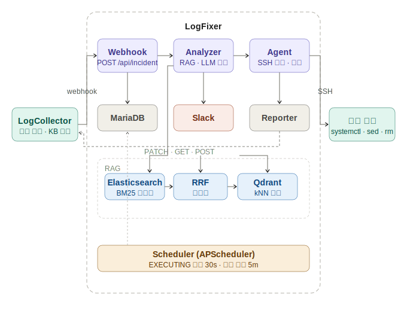

---

## 전체 처리 흐름

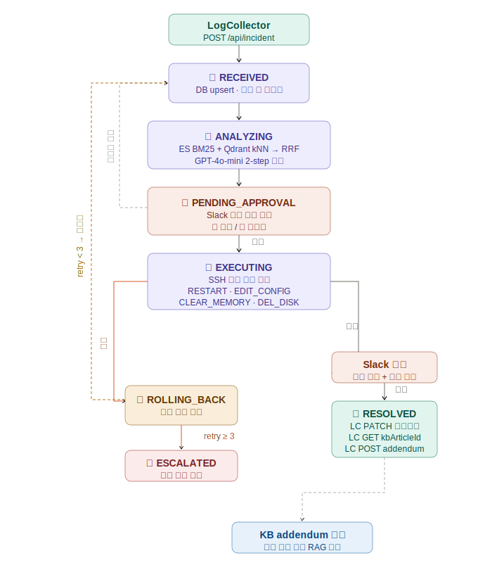

---

## 증적 (실제 동작 화면)

### 1. LC → LogFixer 웹훅 수신

LogCollector가 장애를 감지하면 LogFixer `/api/incident`로 웹훅을 전송합니다.  
수신 즉시 DB에 저장하고 `RECEIVED` 상태로 응답합니다.

<!-- 이미지 삽입: docs/images/LC_LF_로그처리받기.png -->
<!-- 설명: PowerShell 웹훅 POST 전송 → logHash=flow001 RECEIVED 응답 확인 -->
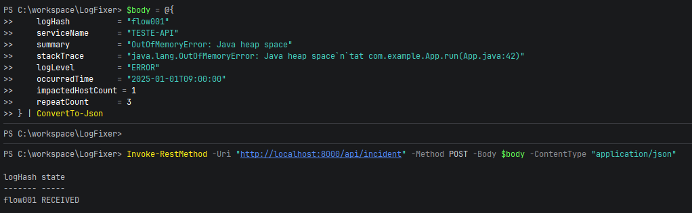

<!-- 이미지 삽입: docs/images/LC_LF_로그처리받기_2.png -->
<!-- 설명: GET /api/incident/flow001 — state, retry_count 등 DB 저장 상태 조회 -->
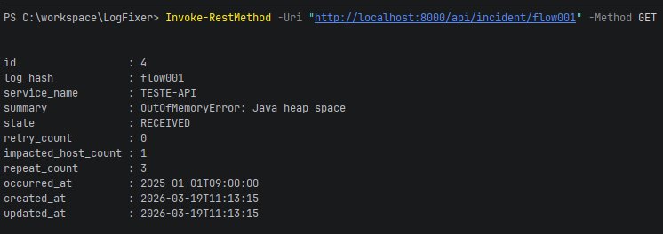

---

### 2. RAG + LLM 자동 분석

ES BM25 + Qdrant kNN으로 유사 KB를 검색하고, RRF 재랭킹 결과를 컨텍스트로  
GPT-4o-mini 2-step 분석(root_cause → solutions ranking)을 실행합니다.  
분석 완료 시 `PENDING_APPROVAL` 상태로 전이하고 Slack 승인 요청을 발송합니다.

<!-- 이미지 삽입: docs/images/RAG_AI분석.png -->
<!-- 설명: BM25/kNN 검색 → RRF → LLM 2-step → PENDING_APPROVAL 전이 → Slack 발송 전 과정 로그 -->
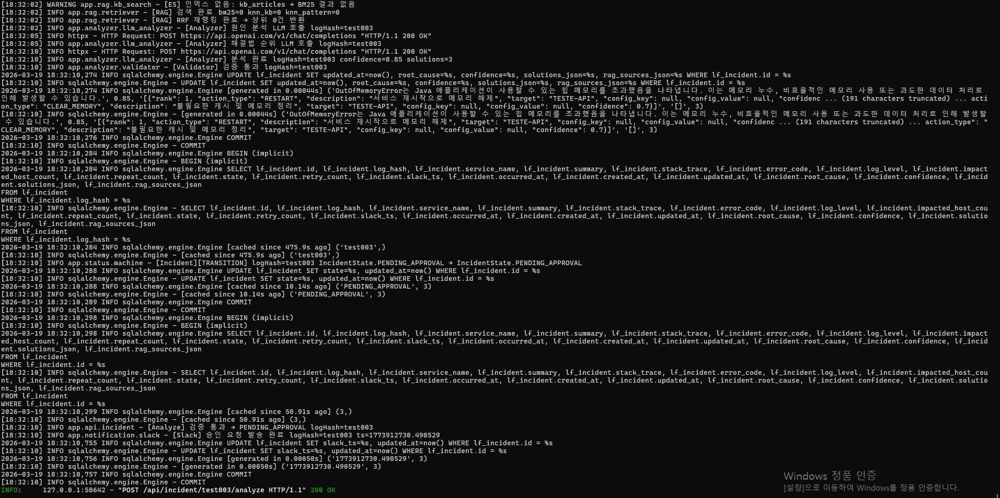

---

### 3. Slack 장애 분석 결과 알림 (승인 요청)

분석 완료 시 서비스명·원인·신뢰도·해결법 후보를 Slack으로 전송합니다.  
담당자는 `[✅ 승인]` 또는 `[❌ 재분석]` 버튼으로 응답합니다.

<!-- 이미지 삽입: docs/images/슬랙—승인요청알림.png -->
<!-- 설명: Slack #error_manager 채널 — 분석 결과 메시지, 신뢰도 85%, 해결법 3개, 승인/재분석 버튼 -->
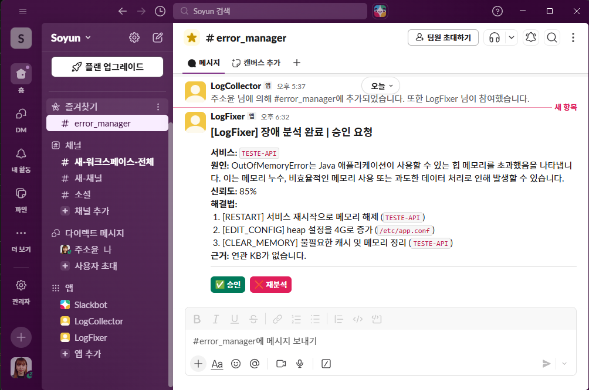

---

### 4. Slack 승인 → 상태 전이

`[✅ 승인]` 버튼을 누르면 `/api/slack/actions`가 호출되고  
`PENDING_APPROVAL → EXECUTING` 상태 전이가 이루어집니다.

<!-- 이미지 삽입: docs/images/슬랙승인시_state전이.png -->
<!-- 설명: approve payload 수신 → "[Slack] 승인 완료 logHash=flow001" 로그 -->
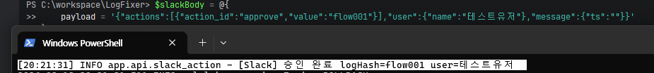

---

### 5. 해결 완료 → LC에 결과 보고 (resolve)

실행 성공 후 담당자 승인을 통해 `RESOLVED` 처리 시,  
LC에 순서대로 상태 변경 → kbArticleId 조회 → addendum 저장을 호출합니다.

<!-- 이미지 삽입: docs/images/LF_resolve처리_전.png -->
<!-- 설명: resolve 호출 전 — LC 화면에서 해당 incident IN_PROGRESS 상태 -->
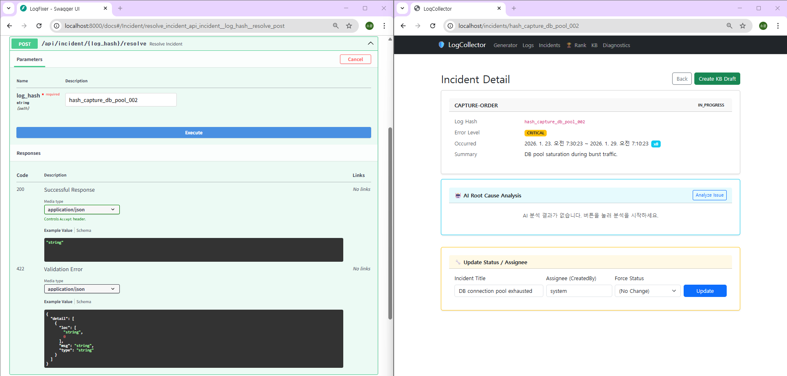

<!-- 이미지 삽입: docs/images/LF_resolve처리_후.png -->
<!-- 설명: resolve POST 후 — 응답 body state: RESOLVED, lcReported: true / LC 화면 RESOLVED 반영 -->
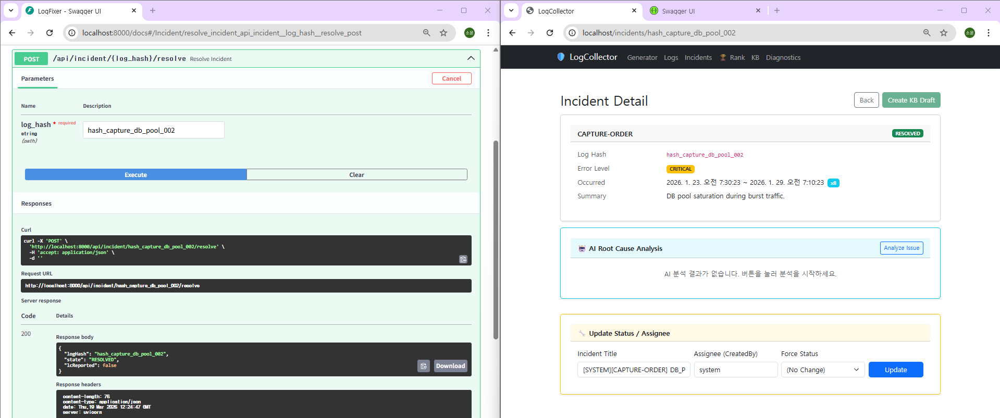

---

### 6. 해결 실패 시 — 자동 롤백 및 재시도

SSH 실행이 실패하면 `ROLLING_BACK` 상태로 전이하고, 성공한 액션들을 역순으로 롤백합니다.  
`retry_count < 3`이면 `RECEIVED`로 복귀해 재분석을 재시도합니다.

<!-- 이미지 삽입: docs/images/해결실패시_롤백.png -->
<!-- 설명: 존재하지 않는 호스트로 실행 시도 → SSH 실패 → ROLLING_BACK 전이 로그 -->
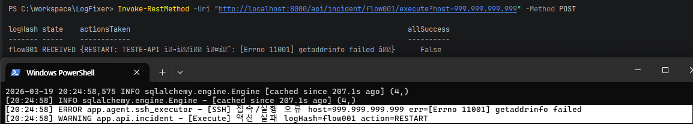

<!-- 이미지 삽입: docs/images/롤백처리.png -->
<!-- 설명: ROLLING_BACK → RECEIVED 재오픈 로그 -->
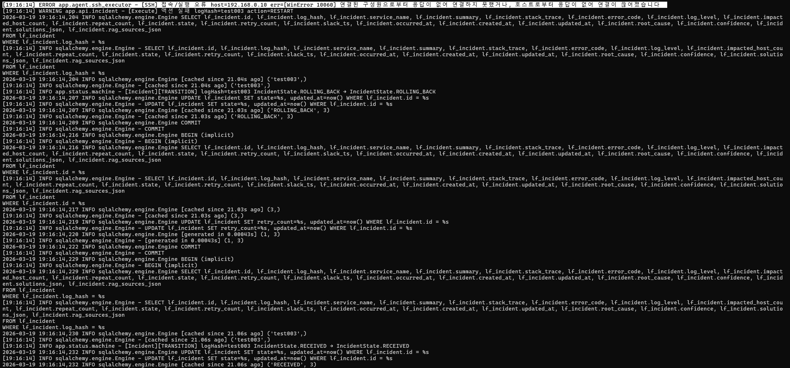

---

### 7. 재발 감지 → 자동 재오픈

이미 `RESOLVED` 처리된 장애와 동일한 `logHash`로 웹훅이 재수신되면,  
`RESOLVED → RECEIVED` 전이와 함께 retry_count를 초기화하고 재분석을 시작합니다.

<!-- 이미지 삽입: docs/images/재발_state전이.png -->
<!-- 설명: 동일 logHash 재수신 → RESOLVED → RECEIVED 재오픈, repeatCount 갱신 -->
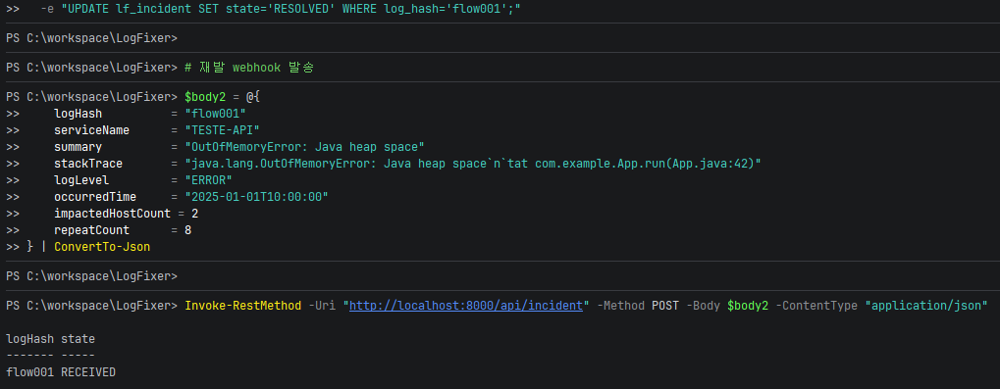

---

### 8. KB Addendum 자동 작성 (자기 학습 루프)

`RESOLVED` 처리 완료 후 LC의 KbArticle에 분석 결과·실행 내역·해결 시각이 자동으로 기록됩니다.  
이 데이터는 다음 유사 장애 발생 시 RAG 검색 컨텍스트로 재활용됩니다.

<!-- 이미지 삽입: docs/images/kb_addenum_자동_작성.png -->
<!-- 설명: LC KB Article 상세 화면 — "Resolution Notes & Updates"에 LogFixer Agent가 자동 작성한 분석 결과/실행 내역/신뢰도 -->
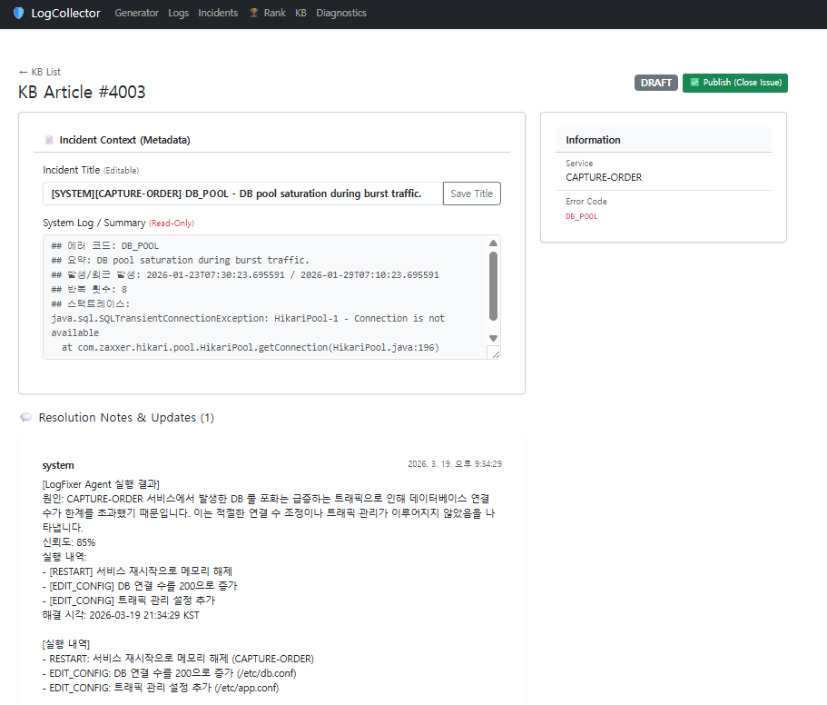

---

## 상태머신 (IncidentState)

전이 규칙을 `ALLOWED_TRANSITIONS` 딕셔너리로 코드에 명시하고,  
허용되지 않은 전이 시도는 즉시 예외를 발생시켜 잘못된 상태 변경을 원천 차단합니다.

```
RECEIVED
   │
   ▼
ANALYZING
   │
   ▼
PENDING_APPROVAL ──(재분석 요청)──→ RECEIVED
   │
   ▼ (담당자 승인)
EXECUTING
   │
   ├──(성공)──→ RESOLVED ──→ LC 상태 변경 + addendum 저장
   │
   └──(실패)──→ ROLLING_BACK
                    │
                    ├──(retry < 3)──→ RECEIVED (재시도)
                    │
                    └──(retry ≥ 3)──→ ESCALATED (수동 대응)
```

```python
# app/status/machine.py
ALLOWED_TRANSITIONS: dict[IncidentState, list[IncidentState]] = {
    IncidentState.RECEIVED:         [IncidentState.ANALYZING],
    IncidentState.ANALYZING:        [IncidentState.PENDING_APPROVAL],
    IncidentState.PENDING_APPROVAL: [IncidentState.EXECUTING, IncidentState.RECEIVED],
    IncidentState.EXECUTING:        [IncidentState.RESOLVED, IncidentState.ROLLING_BACK],
    IncidentState.ROLLING_BACK:     [IncidentState.RECEIVED, IncidentState.ESCALATED],
    IncidentState.RESOLVED:         [],
    IncidentState.ESCALATED:        [],
}
```

---

## LC ↔ LogFixer 연동

| 방향 | 방식 | 설명 |
|---|---|---|
| LC → LogFixer | Webhook push | 장애 발생 시 `POST /api/incident`로 실시간 전달 |
| LogFixer → LC | REST API 호출 | 해결 완료 후 순차 호출 |

해결 완료 후 LC API를 아래 순서로 호출합니다.  
kbArticleId 조회는 LC 측 생성 시간이 필요하므로 **최대 5회 retry (3초 간격)** 를 적용했습니다.

```
1. PATCH /api/incidents/{logHash}/status    →  상태 → RESOLVED
2. GET   /api/kb/articles/by-hash/{logHash} →  kbArticleId 조회 (retry × 5)
3. POST  /api/kb/{kbArticleId}/addendums    →  분석 결과 + 실행 이력 저장
```

---

## API 엔드포인트

| 메서드 | 경로 | 설명 |
|---|---|---|
| `GET` | `/health` | 헬스 체크 |
| `POST` | `/api/incident` | LC 웹훅 수신 — RECEIVED 저장 |
| `GET` | `/api/incident/{log_hash}` | Incident 상태 조회 |
| `POST` | `/api/incident/{log_hash}/analyze` | 분석 수동 트리거 (dev/test) |
| `POST` | `/api/incident/{log_hash}/execute` | 실행 수동 트리거 (dev/test) |
| `POST` | `/api/incident/{log_hash}/resolve` | RESOLVED 처리 + LC 보고 |
| `POST` | `/api/slack/actions` | Slack 버튼 액션 수신 |

---

## 프로젝트 구조

```
LogFixer/
├── app/
│   ├── main.py                    # FastAPI 앱, lifespan (DB·Qdrant 초기화, Scheduler 시작)
│   ├── api/
│   │   ├── incident.py            # 웹훅 수신, 분석/실행/해결 엔드포인트
│   │   └── slack_action.py        # Slack Interactive Action (승인·재분석·resolve 버튼)
│   ├── analyzer/
│   │   ├── llm_analyzer.py        # RAG 검색 → GPT-4o-mini 2-step 분석 메인 로직
│   │   ├── validator.py           # 분석 결과 신뢰도·완결성 검증
│   │   └── prompts/               # root_cause / solution_rank 프롬프트 빌더
│   ├── agent/
│   │   ├── ssh_executor.py        # Paramiko 기반 SSH 명령 실행
│   │   ├── action_registry.py     # action_type → Action 클래스 매핑
│   │   ├── rollback.py            # 역순 롤백 실행
│   │   └── actions/               # RESTART / EDIT_CONFIG / CLEAR_MEMORY / DEL_DISK
│   ├── rag/
│   │   └── retriever.py           # ES BM25 + Qdrant kNN → RRF 재랭킹
│   ├── vectordb/
│   │   ├── store.py               # Qdrant 컬렉션 upsert
│   │   └── embedder.py            # text-embedding-3-small 임베딩
│   ├── reporter/
│   │   └── kb_updater.py          # LC PATCH / GET / POST 순차 호출
│   ├── notification/
│   │   └── slack.py               # Slack 메시지 빌더 + 발송
│   ├── scheduler/
│   │   └── jobs.py                # APScheduler: 실행 감시(30s) / 재발 감지(5m)
│   ├── status/
│   │   └── machine.py             # 상태머신 + upsert_incident
│   ├── db/
│   │   ├── models.py              # SQLAlchemy ORM (LfIncident)
│   │   └── session.py             # async 세션 팩토리
│   └── core/
│       ├── config.py              # 환경변수 로드
│       ├── enums.py               # IncidentState
│       └── exceptions.py          # 커스텀 예외
└── docker/
    └── docker-compose.yml         # MariaDB / Qdrant / Elasticsearch
```

---

## 실행 방법

**인프라 실행** (MariaDB · Qdrant · Elasticsearch)

```bash
cd docker && docker compose up -d
```

**애플리케이션 실행**

```bash
cp .env.example .env    # API 키 등 환경변수 설정
pip install -r requirements.txt
uvicorn app.main:app --host 0.0.0.0 --port 8000 --reload
```

**헬스 체크**

```bash
curl http://localhost:8000/health
# {"status": "ok", "env": "development"}
```

---

## 환경변수 (.env)

| 변수 | 설명 |
|---|---|
| `OPENAI_API_KEY` | GPT-4o-mini / text-embedding-3-small 호출용 키 |
| `SLACK_BOT_TOKEN` | Slack Bot OAuth 토큰 (`xoxb-...`) |
| `SLACK_CHANNEL_ID` | 알림을 보낼 Slack 채널 ID |
| `LC_BASE_URL` | LogCollector 서버 주소 |
| `DB_HOST / DB_NAME / DB_USER / DB_PASSWORD` | MariaDB 접속 정보 |
| `QDRANT_HOST / QDRANT_PORT` | Qdrant 접속 정보 |
| `ES_HOST` | Elasticsearch 주소 |
| `SSH_DEFAULT_USER / SSH_DEFAULT_KEY_PATH` | SSH 접속 계정 및 개인키 경로 |
